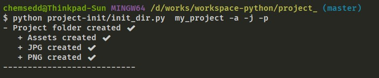
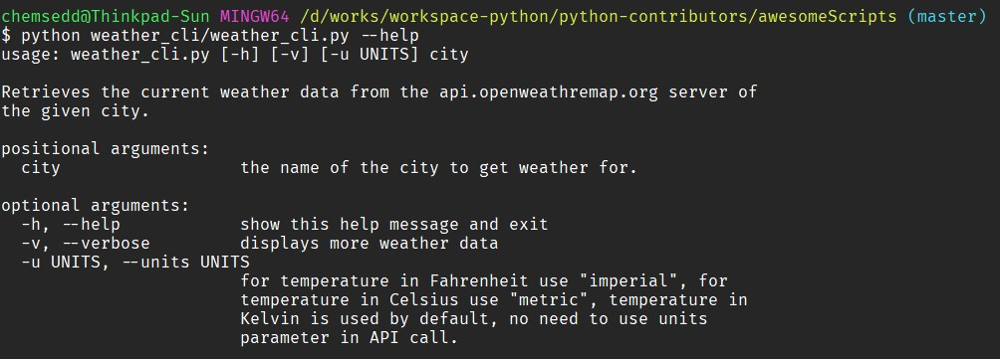
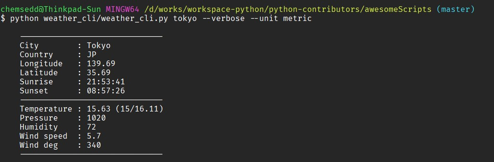
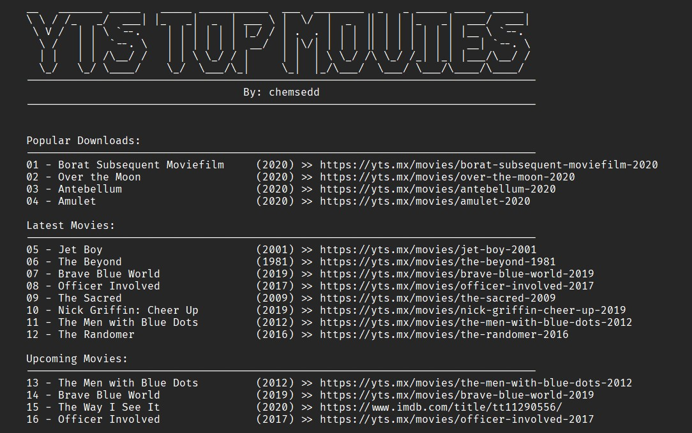

# Python Scripts

This is a small repositery that contains different python scripts that i use to ease my daily tasks.

# Contents

- [Project init](https://github.com/chemsedd/python-scripts/tree/master/project-init)
- [Weather API](https://github.com/chemsedd/python-scripts/tree/master/weather-api)
- [YTS Top Movies](https://github.com/chemsedd/python-scripts/tree/master/yts-top-movies)

### Project init
A small command line tool that automates the creation of folders. I use it specifically for initializing a design project (Adobe illustrator or Adobe Photoshop).

#### Example:
```bash
python init_dir.py --path my_project -a -j -p
```



### Weather API
A command line tool for retrieving weather data from the api.openweathermap.org server. The website provides current detailed weather data about a long list of cities around the world. The command line offers easy retrieval of these data.

```bash
python get-weather.py london --verbose
```

#### Example:




## YTS Top Movies
Retreives top movies from the YTS website, and display them with some information. The script scrappes the HTML from the website and retreives the data. Then displays in on the console.

```bash
python yts-top-movies.py
```

### Example:

